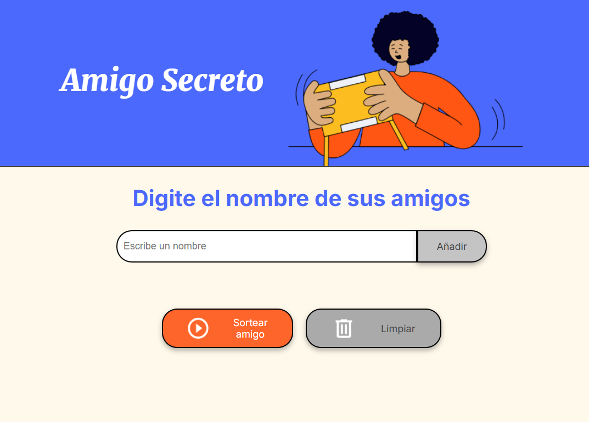
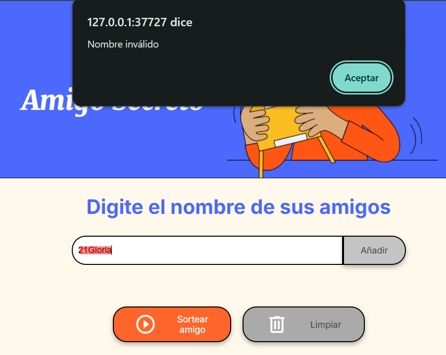
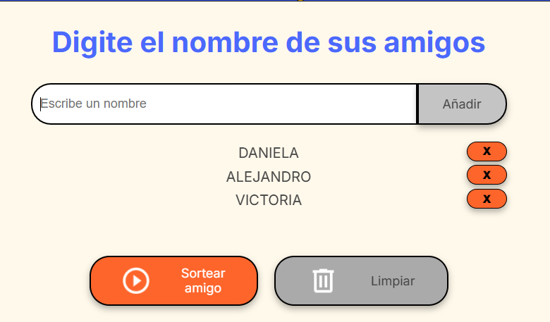
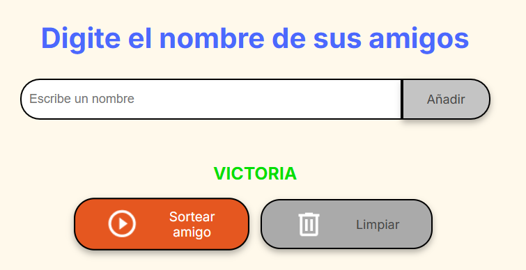

# Challenge Amigo secreto

Este desafío consiste desarrollar una aplicación que permita a los usuarios ingresar nombres de amigos en una lista para luego realizar un sorteo aleatorio y determinar quién es el "amigo secreto".

El usuario deberá agregar nombres mediante un campo de texto y un botón "Adicionar". Los nombres ingresados se mostrarán en una lista visible en la página, y al finalizar, un botón "Sortear Amigo" seleccionará uno de los nombres de forma aleatoria, mostrando el resultado en pantalla.

---

## Funcionalidades:

-   **_Agregar nombres:_** Los usuarios escribirán el nombre de un amigo en un campo de texto y lo agregarán a una lista visible al hacer clic en **_"Añadir"_**.

    

-   **_Validar entrada:_** Si el campo de texto está vacío, el programa mostrará una alerta pidiendo un nombre válido.

  

-   **_Visualizar la lista:_** Los nombres ingresados aparecerán en una lista debajo del campo de entrada.

  

-   **_Sorteo aleatorio:_** Al hacer clic en el botón **_"Sortear Amigo"_**, se seleccionará aleatoriamente un nombre de la lista y se mostrará en la página.

  

---
